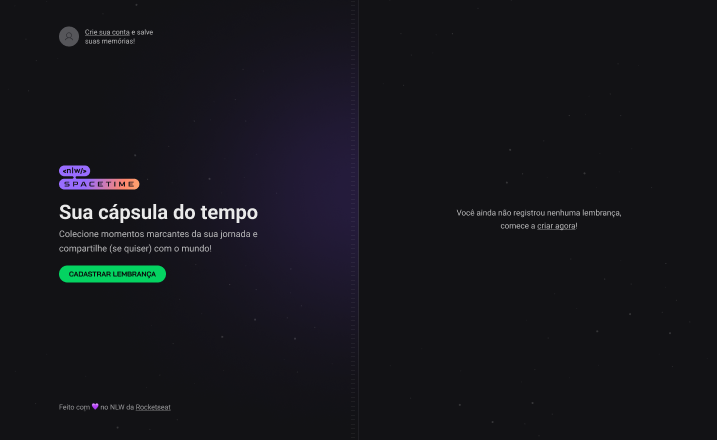
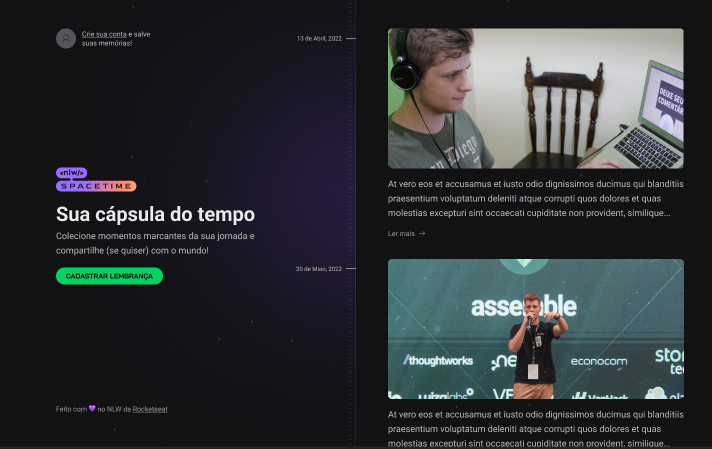
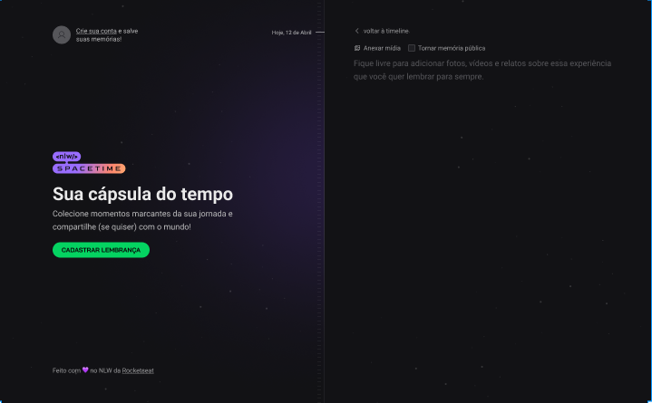
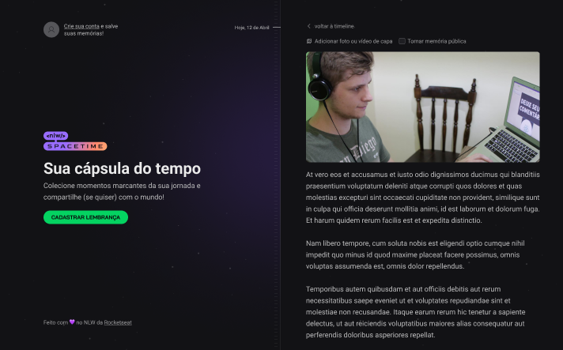
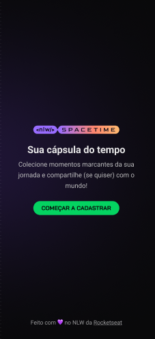
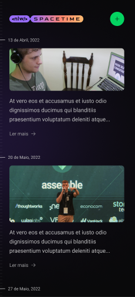
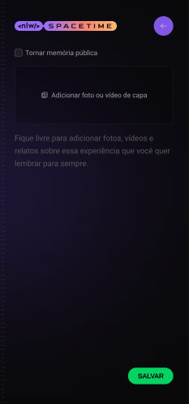
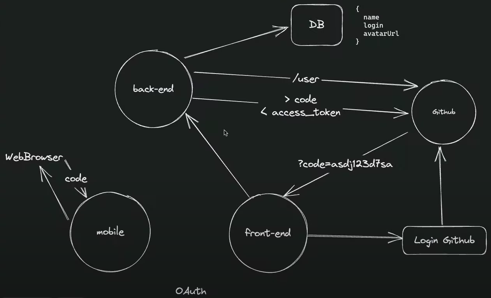

  <h1> NLW Spacetime </h1>

 

  

 

  

 

  

 

  

 

| | | | |
| :---------------------------------------------------------------------------------: | :-------------------------------------------------------------------------------: | :------------------------------------------------------------------------------------: | :------------------------------------------------------------------------------------: |
|       |      |      |      |
 

 <a href="#theproject">The Project</a> •
 <a href="#target">Target</a> •
 <a href="#technologies">Technologies</a> •
 <a href="#route">Route</a> •
 <a href="#howtouse">How to Use</a>

 

<h2> 📓 The Project </h2>

 NLW Spacetime platform to recall memory, where the user can add texts, photos and videos of important events in his life to a timeline, organized by month and year (web platform and mobile) 

<h2> 💡 Target </h2>
Development of an NLW Spacetime platform to recall memory, where the user can add texts, photos and videos of important events in his life to a timeline, organized by month and year (web platform and mobile versions) at NLW (Next Level Week), from Rocketseat

 

<h2> 🛠 Technologies </h2>
The following tools were used in building the project:  

|                       Type                       |           Tools           |            References             |
| :----------------------------------------------: | :-----------------------: | :-------------------------------: |
|                       IDE                        |          VS CODE          |  https://code.visualstudio.com/     |
|              Design Interface Tool               | FIGMA (Prototype - UX/UI) |      https://www.figma.com/                  |
|         Programming Language (Frontend)          |           REACT           |       https://reactjs.org/                  |
|          Programming Language (Mobile)           |       REACT NATIVE        |     https://reactnative.dev/      |
| Programming Language (Backend, Frontend, Mobile) |        TYPESCRIPT         |  https://www.typescriptlang.org/   |
|          React web framework (Frontend)          |          NEXT.JS          |      https://nextjs.org/                  |
|        API and backend services (Backend)        |          NODE.JS          |        https://nodejs.org/                  |
|          NodeJS web framework (Backend)          |          FASTIFY          |      https://www.fastify.io/           |
| Open source API development ecosystem (Testing)  |        HOPPSCOTCH         |      https://hoppscotch.io/        |
|          Open source platform (Mobile)           |    EXPO BARE WORKFLOW     |         https://expo.dev/                  |
|      Utility-first CSS Framework (Frontend)      |       TAILWIND CSS        |     https://tailwindcss.com/      |
|    Tool for transforming CSS with JavaScript     |         POST CSS          |       https://postcss.org/                  |
|      Graphic components (Frontend, Mobile)       |        LUCIDE-REACT       |    https://lucide.dev/                  |
|    UI Utility-first Component Library (Mobile)   |        NATIVE BASE        |      https://nativebase.io/        |
|        Navigation between pages (Mobile)         |     REACT NAVIGATION      |  https://reactnavigation.org/  |
|                Database (Backend)                |          SQLITE           | https://www.sqlite.org/index.html            |
|  Promise based HTTP client - browser & Node.js   |           AXIOS           |      https://axios-http.com/       |
|             UI Components for React              |         RADIX-UI          |     https://www.radix-ui.com/         |
|  Node.js and TypeScript ORM (Backend, Database)  |          PRISMA           |      https://www.prisma.io/            |
 

  <h3>Backend | API</h3>
  
  
  <!--  -->
   
  
   
  <h3>Testing</h3>
  
   
  <h3>Database</h3>
  
  
   
  <h3>IDE</h3>
  
   
  <h3>UX/UI</h3>
  
  
  
   
  <h3>Frontend</h3>
  
  
  
   
  
   
  <h3>Mobile</h3>
  
  
  
  
   

 

<h2> 🔎 Route </h2>
  <ol>
    <li &nbsp;>Part 1 - Starting the project end-to-end 
      <ul &nbsp;>
        <li &nbsp;>Build the project prototype: https://www.figma.com/file/G8PUN4pJqzxEzxPNd7eP5z/C%C3%A1psula-do-tempo-%E2%80%A2-Trilha-Ignite-(Community)?type=design&node-id=205-3&t=7bhiHbk0QWYK3QZT-0</li>
        <li>Install VS Code (IDE)</li>
        <li>Install VS Code extensions: NodeJS, Prisma, Tailwind CSS IntelliSense, PostCSS Language Support, Symbols, Fluent Icons, GitLens, ESLint, DotENV</li>
        <li &nbsp;><b>Backend project</b>
          <ul>
            <li>Create a new project: mkdir backend</li>
            <li>Enter backend project: cd backend</li>
            <li>Install Node and start: npm init -y</li>
            <li>Install Fastify framework: npm i fastify</li>
            <li>Configure server and ports: ./src/server.ts</li>
            <li>Install TypeScript for development environment:
              <ul>
                <li>npm i typescript -D</li>
                <li>npx tsc --init (Settings file for TS)</li>
                <li>npm i tsx -D (Automatically updates)</li>
                <li>Change ts config file: ./tsconfig.json</li>
              </ul>
            </li>
            <li>Configure the package.json: ./package.json </li>
            <li>Run the application: npm run dev</li>
            <li>Define "Use Cases"</li>
            <li>Set routes: ./src/server.ts</li>
            <li>Install plugins: npm i @rocketseat/eslint-config prettier-plugin-tailwindcss -D</li>
            <li>Install and set Prisma
              <ul>
                <li>Install (for development): npm i prisma -D</li>
                <li>Install Prisma Client: npm i @prisma/client</li>
                <li>Set Database SQLite: npx prisma init --datasource-provider SQLite</li>
                <li>Create tables and entities: ./prisma/schema.prisma</li>
                <li>Run migrations: npx prisma migrate dev
                  <ul>
                    <li>Name for the new migration: create the rest of the tables</li>
                    <li>Name for the new migration: create users table</li>
                    <li>Name for the new migration: create relations</li>
                  </ul>
                </li>
                <li>To see DB generated from Prisma: npx prisma studio</li>
                <li>Generate: npx prisma generate</li>
              </ul>
            </li>
          </ul>
        </li>
        <li &nbsp;><b>Frontend project</b>
          <ul>
            <li>Create the frontend project (React, Next.js and TypeScript): npx create-next-app@latest frontend --use-npm</li>
            <li>Build the project: npm run build</li>
            <li>Install plugins: npm i @rocketseat/eslint-config prettier-plugin-tailwindcss -D</li>
            <li>Use prettier-eslint: ./prettier.config.js</li>
            <li>Customize contents, themes, fonts and plugins with Tailwind: ./tailwind.config.js</li>
            <li>Customize the main style: ./src/app/styles/global.css</li>
            <li>To run project: npm run dev</li>
          </ul>
        </li>
        <li &nbsp;><b>Mobile project</b>
          <ul>
            <li>Install "R Component" extension at VS Code</li>
            <li>Install Expo CLI: npm install --global expo-cli</li>
            <li>Create a new project: npx create-expo-app mobile</li>
            <li>Navigate to project directory: cd mobile</li>
            <li>Open the project on VS Code: code .</li>
            <li>Change App.js to App.tsx</li>
            <li>Run app and accept download TS libs: npm start</li>
            <li>Install Nativewind: npm i nativewind</li>
            <li>Set TailwindCSS:
              <ul>
                <li>Install plugin: npm i tailwindcss -D</li>
                <li>Initialization: npx tailwindcss init</li>
              </ul>
            </li>
            <li>Set ESLint:
              <ul>
                <li>Install plugins: npm i @rocketseat/eslint-config eslint -D</li>
                <li>Create and set file: ./.eslintrc.json</li>
              </ul>
            </li>
            <li>Set Prettier:
              <ul>
                <li>Install plugin: npm i prettier-plugin-tailwindcss -D</li>
                <li>Create and set file: ./prettier.config.js</li>
              </ul>
            </li>
            <li>Run Expo Go: npx expo start</li>
            <li>Install Native Base on project:
              <ul>
                <li>npm install native-base</li>
                <li>npx expo install react-native-svg </li>
                <li>npx expo install react-native-safe-area-context</li>
              </ul>
            </li>
            <li>Start the development server: npx expo start</li>
            <li>Configure the Expo Go on a mobile device or use an emulator</li>
            <li>Open the app on a mobile device:
              <ul>
                <li>On your iPhone or iPad, open the default Apple "Camera" app and scan the QR code you see in the terminal</li>
                <li>On your Android device, press "Scan QR Code" on the "Projects" tab of the Expo Go app and scan the QR code you see in the terminal.</li>
              </ul>
            </li>
          </ul>
        </li>
      </ul>
    </li>
     
    <li &nbsp;>Part 2 - Advancing the backend and frontend 
      <ul &nbsp;>
        <li &nbsp;><b>Backend project</b>
          <ul>
            <li>Define "Use Cases"</li>
            <li>Set Prisma structure
              <ul>
                <li>Migration
                  <ol>
                    <li>Reset the previous migration: npx prisma migrate reset</li>
                    <li>Run migrations: npx prisma migrate dev
                      <ul>
                        <li>Name for the new migration: create the rest of the tables</li>
                        <li>Name for the new migration: create memories table</li>
                        <li>Name for the new migration: create relations</li>
                      </ul>
                    </li>
                  </ol>
                </li>
                <li>Open Prisma Studio: npx prisma studio</li>
                <li>Create Seed: ./prisma/seed.ts</li>
                <li>Run seed: npx prisma db seed</li>
              </ul>
            </li>
          </ul>
        </li>
        <li>Zod: npm i zod</li>
        <li>Memory CRUD: ./src/routes/memories.ts
          <ul>
            <li>List</li>
            <li>Create</li>
            <li>Detail</li>
            <li>Update</li>
          </ul>
        </li>
        <li>Cors library (Protection for non-desirable access) 
          <ul>
            <li>Install CORS: npm i @fastify/cors</li>
          </ul>
        </li>
        <li &nbsp;><b>Frontend project</b>
          <ul>
            <li>Set Google Fonts
              <ul>
                <li>Layout: ./src/app/layout.tsx</li>
                <li>CSS: ./src/app/globals.css</li>
                <li>Tailwind: ./tailwind.config.js</li>
              </ul>
            </li>
            <li>Set the Home Page: ./src/app/page.tsx
              <ul>
                <li>Blur background and Stripes: ./tailwind.config.js</li>
                <li>Convert a svg file code to React component: https://svg2jsx.com/</li>
                <li>Install Lucide-React icon plugin: npm i lucide-react</li>
              </ul>
            </li>
          </ul>
        </li>
        <li &nbsp;><b>Mobile project</b>
          <ul>
            <li>Images, theme and utils for the project: 
              <ul>
                <li>Install images plugins:
                  <ol>
                    <li>React Native Svg Library: expo install react-native-svg</li>
                    <li>React-Native-SVG-Transformer: npm i react-native-svg-transformer -D</li>
                    <li>Set: ./tailwind.config.js</li>
                    <li>Comunnicate to TS image types available: ./src/assets/assets.d.ts</li>
                  </ol>
                </li>
              </ul>
            </li>
            <li>Fonts
              <ul>
                <li>Install Google Fonts: npx expo install expo-font @expo-google-fonts/roboto @expo-google-fonts/bai-jamjuree</li>
                <li>Set: ./tailwind.config.js</li>
                <li>Set customized font: ./App.tsx</li>
              </ul>
            </li>
            <li>Create the Splash Page</li>
            <li>Use React Hooks: useState, useEffect, ...</li>
            <li>Create Home screen: ./App.tsx</li>
          </ul>
        </li>
      </ul>
     
    <li &nbsp;>Part 3 - Integrating UI with libraries 
      <ul &nbsp;> 
        <li &nbsp;><b>Backend project</b>
          <ul>
            <li>Environment variables
              <ol>
                <li>Install package: npm i dotenv -D</li>
                <li>Github OAuth variables: ./.env</li>
                <li>Import dotenv/config at ./src/server.ts</li>
              </ol>
            </li>
            <li>Axios: npm i axios</li>
            <li>JWT: npm i @fastify/jwt</li>
            <li>Routes:
              <ul>
                <li>Auth route: ./src/routes/auth.ts</li>
                <li>Athenticated routes
                  <ul>
                    <li>Set global type: ./src/auth.d.ts</li>
                    <li>Set auth require: ./src/routes/memoriesRoutes.ts</li>
                  </ul>
                </li>
              </ul>
            </li>
            <li>File upload
              <ul>
                <li>Fastify Multipart: npm i @fastify/multipart</li>
                <li>Route: ./src/routes/upload.ts</li>
                <li>Update server file: ./src/server.ts</li>
              </ul>
            </li>
            <li>Static files URL
              <ul>
                <li>Fastify Static: npm i @fastify/static</li>
                <li>Set: ./src/server.ts</li>
              </ul>
            </li>
          </ul>
        </li>
        <li &nbsp;><b>Frontend project</b>
          <ul>
            <li>Authentication:
              <ol>
                <li>Auth flow
                  

                    
                  

                </li>
                <li>Github OAuth settings
                  <ol>
                    <li>Create an application at http://github.com/settings/developers</li>
                    <li>Set environment variables at: ./.env.local</li>
                  </ol>
                </li>
                <li>Getting Gihub code web</li>
              </ol>
            </li>
            <li>Set components
              <ol>
                <li>Copyright: ./src/components/Copyright.tsx</li>
                <li>Empty memory list: ./src/components/EmptyMemories.tsx</li>
                <li>Hero section: ./src/components/Hero.tsx</li>
                <li>SignIn: ./src/components/SignIn.tsx</li>
              </ol>
            </li>
            <li>Axios: npm i axios</li>
            <li>Saving token at cookies
              <ol>
                <li>JWT lib: npm i jwt-decode</li>
                <li>Set auth lib: ./src/lib/auth.ts</li>
              </ol>
            </li>
            <li>User profile
              <ol>
                <li>Next Config: ./next.config.js</li>
                <li>Component: ./src/components/Profile.tsx</li>
                <li>Set profile on home: ./src/app/page.tsx</li>
              </ol>
            </li>
          </ul>
        </li>
        <li &nbsp;><b>Mobile project</b>
          <ul>
            <li>Install Expo-Auth-Session / Expo Crypto: npx expo install expo-auth-session expo-crypto</li>
            <li>Set Github OAuth (Expo)</li>
            <li>Get Github code mobile: ./App.tsx</li>
            <li>Save token at secure store
              <ol>
                <li>Axios: npm i axios</li>
                <li>Expo Secure Store: npx expo install expo-secure-store</li>
                <li>Implementing: ./App.tsx</li>
              </ol>
            </li>
            <li>User navigation
              <ul>
                <li>Install React Navigation / Expo Router on project:
                  <ul>
                    <li>npx expo install expo-router</li>
                    <li>npx expo install expo-linking</li>
                    <li>npx expo install expo-constants</li>
                    <li>npx expo install expo-status-bar</li>
                    <li>npx expo install react-native-screens</li>
                    <li>npx expo install react-native-safe-area-context</li>
                  </ul>
                </li>
                <li>Create and set App file: ./app/index.tsx</li>
                <li>Use Expo Router</li>
              </ul>
            </li>
          </ul>
        </li>
        <li &nbsp;><b>Testing</b>
          <ul>
            <li>Test backend at Hoppscotch: https://hoppscotch.io/</li>
          </ul>
        </li>
      </ul>
    </li>
     
    <li &nbsp;>Part 4 - Integrating web and mobile projects 
      <ul &nbsp;>
        <li &nbsp;><b>Frontend project</b>
          <ul>
            <li>Routes
              <ul>
                <li>Set route layout: ./src/app/layout.tsx</li>
                <li>Logout route: ./src/app/api/auth/logout/route.ts</li>
              </ul>
            </li>
            <li>New memory page: ./src/app/memories/new/page.tsx</li>
            <li>Auth middleware: ./src/middleware.ts</li>
            <li>Tailwind forms: npm i -D @tailwindcss/forms</li>
          </ul>
        </li>
        <li &nbsp;><b>Mobile project</b>
          <ul>
            <li>Starting the server</li>
            <li>Connect with API (backend service)</li>
            <li>Set routes layout: ./app/_layout.tsx</li>
            <li>Customize app initial route: ./app/index.tsx</li>
            <li>New memory page: ./app/new.tsx</li>
          </ul>
        </li>
      </ul> 
    </li> 
     
    <li &nbsp;>Part 5 - The next level 
      <ul &nbsp;>
        <li &nbsp;><b>Frontend project</b>
          <ul>
            <li>Create new memory
              <ul>
                <li>MediaPicker: ./src/components/MediaPicker.tsx</li>
              </ul>
            </li>
            <li>Media Preview
              <ul>
                <li>New Memory Form = ./src/components/NewMemoryForm.tsx</li>
                <li>JS-Cookie: npm i js-cookie</li>
                <li>JS-Cookie for TS: npm i -D @types/js-cookie</li>
              </ul>
            </li>
            <li>List layout</li>
            <li>Search memories from API</li>
          </ul>
        </li>
        <li &nbsp;><b>Mobile project</b>
          <ul>
            <li>Pick an Image
              <ul>
                <li>Expo Image Picker: npx expo install expo-image-picker</li>
                <li>Choose an image from gallery</li>
                <li>Image preview</li>
              </ul>
            </li>
            <li>Create new memory: ./app/new.tsx</li>
            <li>Logout button</li>
            <li>List layout</li>
            <li>Search memories from API</li>
            <li>Testing all</li>
          </ul>
        </li>
      </ul> 
    </li>
     
  </ol>

<h2>🧪 How to use</h2>
  <ol &nbsp;>
    <li &nbsp;>Set the development environment at you local computer</li>
    <li &nbsp;>Clone the repository
      <ul>
        <li>git clone https://github.com/alexandrecpedro/spacetime</li>
      </ul>
    </li>
    <li &nbsp;>Enter the project directory:
      <ul>
        <li>cd spacetime</li>
      </ul>
    </li>
    <li><b>Testing</b>
      <ul>
        <li &nbsp;><u>Backend</u>
          <ol>
            <li &nbsp;>Enter the directory
              <ul>
                <li>cd backend</li>
              </ul>
            </li>
            <li &nbsp;>Install the dependencies
              <ul>
                <li>npm install</li>
              </ul>
            </li>
            <li &nbsp;>Run
              <ul>
                <li>npm run dev</li>
              </ul>
            </li>
          </ol>
        </li>
        <li &nbsp;><u>Frontend</u>
          <ol>
            <li &nbsp;>Enter the directory
              <ul>
                <li>cd frontend</li>
              </ul>
            </li>
            <li &nbsp;>Install the dependencies
              <ul>
                <li>npm install</li>
              </ul>
            </li>
            <li &nbsp;>Run
              <ul>
                <li>npm run dev</li>
              </ul>
            </li>
          </ol>
        </li>
        <li &nbsp;><u>Mobile</u>
          <ol>
            <li &nbsp;>Enter the directory
              <ul>
                <li>cd mobile</li>
              </ul>
            </li>
            <li &nbsp;>Before run the mobile app, check if the following tools are already installed:
              <ul>
                <li &nbsp;><u>Node.js LTS release</u>
                  <ul>
                    <li>https://nodejs.org/en/</li>
                  </ul>
                </li>
                <li &nbsp;><u>Git</u>
                  <ul>
                    <li>https://git-scm.com/downloads</li>
                  </ul>
                </li>
                <li &nbsp;><u>Watchman (only for MacOS and Linux users)</u>
                  <ul>
                    <li>https://facebook.github.io/watchman/docs/install#buildinstall</li>
                  </ul>
                </li>
                <li &nbsp;><u>Expo CLI</u>
                  <ul>
                    <li>npm install --global expo-cli</li>
                  </ul>
                </li>
              </ul>
            </li>
            <li &nbsp;>Install the dependencies
              <ul>
                <li>npx install-expo-modules@latest</li>
                <li &nbsp;>npm install expo</li>
                <li &nbsp;>expo install</li>
                <li &nbsp;>npm install</li>
              </ul>
            </li>
            <li &nbsp;>Run
              <ul>
                <li>npx expo start</li>
              </ul>
            </li>
          </ol>
        </li>
      </ul>
    </li>
  </ol>

